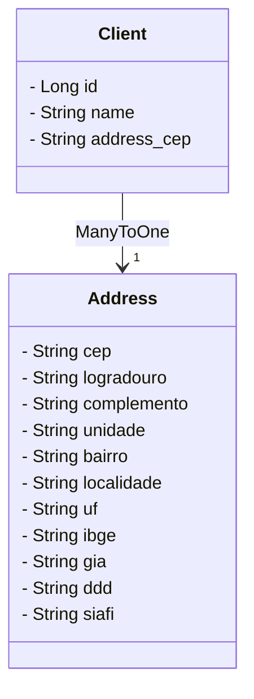

[🇬🇧️](README.md)

# Projeto API de Código Postal

## Índice

- [Visão Geral](#visão-geral)
- [Estrutura do Projeto](#estrutura-do-projeto)
    - [Pacotes](#pacotes)
    - [Classes Principais](#classes-principais)
- [Diagrama DER do Banco de Dados](#diagrama-der-do-banco-de-dados)
- [Começando](#começando)
    - [Pré-requisitos](#pré-requisitos)
    - [Instalação](#instalação)
    - [Executando a Aplicação](#executando-a-aplicação)
- [Uso](#uso)
    - [Endpoints](#endpoints)
- [Visualização da API](#visualização-da-api)
    - [Usando o Swagger](#usando-o-swagger)
    - [Usando o Frontend](#usando-o-frontend)
- [Tecnologias Utilizadas](#tecnologias-utilizadas)

## Visão Geral

O Projeto de API de Código Postal é uma aplicação Spring Boot que fornece uma API RESTful para gerenciar clientes e seus
endereços. Ele integra com o serviço ViaCep para recuperar detalhes de endereço com base em códigos postais (CEPs).

## Estrutura do Projeto

### Pacotes

```
com.tech.postal_code
├── controller
│   └── ClientRestController.java
├── model
│   ├── Address.java
│   └── Client.java
├── repository
│   ├── AddressRepository.java
│   └── ClientRepository.java
├── service
│   ├── ClientService.java
│   ├── ViaCepService.java
│   └── impl
│       └── ClientServiceImpl.java
├── error
│   ├── ApiError.java
│   ├── ApiExceptionHandler.java
│   └── ClientNotFoundException.java
└── ApiProjectApplication.java
```

### Classes Principais

- **ClientRestController.java**: Define os endpoints REST para operações com clientes.
- **Address.java**: Entidade que representa o endereço.
- **Client.java**: Entidade que representa o cliente.
- **AddressRepository.java**: Interface de repositório para operações com endereços.
- **ClientRepository.java**: Interface de repositório para operações com clientes.
- **ClientService.java**: Interface de serviço para operações com clientes.
- **ViaCepService.java**: Interface de serviço para acessar a API ViaCep.
- **ClientServiceImpl.java**: Implementação do ClientService.
- **ApiError.java**: Classe para tratamento de erros da API.
- **ApiExceptionHandler.java**: Manipulador global de exceções para a API.
- **ClientNotFoundException.java**: Exceção personalizada para casos de cliente não encontrado.
- **ApiProjectApplication.java**: Classe principal para inicializar a aplicação Spring Boot.

## Diagrama DER do Banco de Dados



## Começando

### Pré-requisitos

- Java 17 ou superior
- Maven
- Um IDE de sua escolha

### Instalação

1. Clone o repositório:
   ```bash
   git clone https://github.com/yourusername/postal_code_api.git
   cd postal_code_api
   ```

2. Instale as dependências:
   ```bash
   mvn install
   ```

### Executando a Aplicação

1. Execute a aplicação:
   ```bash
   mvn spring-boot:run
   ```

2. A aplicação estará disponível em `http://localhost:8080`.

## Uso

### Endpoints

- **GET /clients**: Recupera todos os clientes.
- **GET /clients/{id}**: Recupera um cliente pelo ID.
- **POST /clients**: Cria um novo cliente.
- **PUT /clients/{id}**: Atualiza um cliente pelo ID.
- **DELETE /clients/{id}**: Deleta um cliente pelo ID.

## Visualização da API

### Usando o Swagger

O Swagger é uma ferramenta que permite visualizar e interagir com a API de forma interativa. Para acessar a documentação
da API via Swagger, siga os passos abaixo:

1. **Certifique-se de que a aplicação está em execução**: A aplicação deve estar rodando localmente no
   endereço `http://localhost:8080`.

2. **Acesse o Swagger UI**: Abra seu navegador e vá para o endereço `http://localhost:8080/swagger-ui.html`.

    - Na interface do Swagger UI, você verá uma lista de todos os endpoints disponíveis na API.
    - Você pode testar os endpoints diretamente pela interface clicando em "Try it out" e preenchendo os parâmetros
      necessários.
    - A documentação é gerada automaticamente com base nas anotações feitas nas classes de controle da API.

### Usando o Frontend

O frontend fornece uma interface gráfica para interagir com a API. Para usar o frontend, siga os passos abaixo:

1. **Certifique-se de que a aplicação está em execução**: A aplicação deve estar rodando localmente no
   endereço `http://localhost:8080`.

2. **Acesse o frontend**: Abra seu navegador e vá para o endereço `http://localhost:8080/web/clients`.

    - Na página inicial, você verá uma lista de clientes cadastrados e um formulário para adicionar novos clientes.
    - **Cadastrar Cliente**: Preencha o formulário com as informações do cliente, incluindo o nome e o CEP (pode ser
      digitado no formato `13026099` ou `13026-099`).
        - Clique no botão "Save" para adicionar o cliente à lista.
    - **Visualizar Informações**: Após cadastrar um cliente, você pode clicar no nome do cliente na lista para
      visualizar seus detalhes.
    - **Buscar Cliente**: Use a barra de busca para filtrar clientes pelo nome. À medida que você digita, a lista será
      atualizada para mostrar apenas os clientes que correspondem ao texto de busca.
    - **Atualizar e Deletar**: Você pode atualizar e deletar clientes diretamente na lista de clientes, clicando nos
      botões apropriados.

Estas funcionalidades fornecem uma maneira fácil e intuitiva de interagir com a API e gerenciar seus dados.

## Tecnologias Utilizadas

- Spring Boot
- Spring Data JPA
- Spring Cloud OpenFeign
- H2 Database
- Thymeleaf
- jQuery
- Lombok

### Explicação

- **Visão Geral**: Dá uma visão geral do projeto.
- **Estrutura do Projeto**: Explica a estrutura do projeto, listando pacotes e classes principais.
- **Diagrama DER do Banco de Dados**: Apresenta o DER do banco de dados.
- **Começando**: Instruções para começar a usar o projeto, incluindo pré-requisitos, instalação e execução.
- **Uso**: Lista os endpoints da API.
- **Tecnologias Utilizadas**: Lista as tecnologias utilizadas no projeto.

Este README deve ajudar qualquer desenvolvedor a entender, configurar e usar o projeto de maneira eficiente.

## Autor

Desenvolvido por Lucas Santos

## Licença

Este projeto está licenciado sob a Licença MIT - veja o arquivo [LICENSE](LICENSE) para detalhes.
